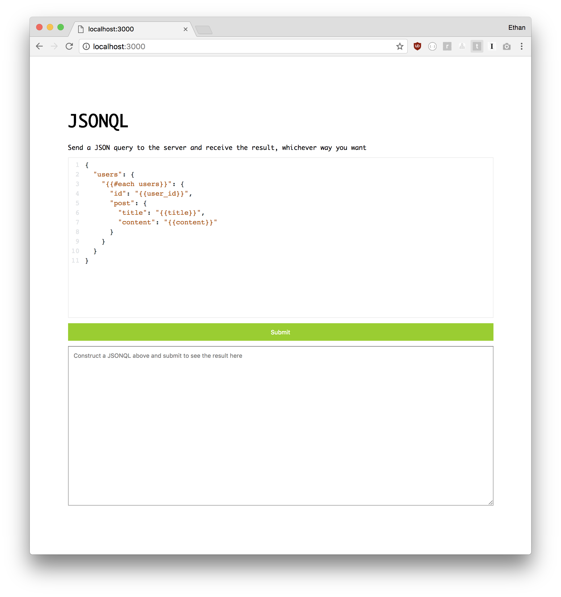

# jsonQL

With ST, you ccan parse any JSON object with a template to create a new JSON.

The powerful thing here is that even the template itself is also written in JSON.

This lets you do all kinds of cool things, such as using it as a JSON payload for a web request.

## Usage

Install dependencies, and then run.

```
$ npm install
$ npm start
```

It will start an `express.js` server and display the following message in the console:

```
Listening!
```

Now open your browser at `http://localhost:3000` and you'll see:



Try pressing "submit". This will:

1. Send a **POST** request to `http://localhost:3000/query` endpoint with the JSON payload.
2. The express server will use that template to transform its data and return result
3. The fetch handler will update the bottom textarea with the response. You can try changing the query JSON from the top editor to get different results.


## How it works

This example demonstrates how you can use ST to write a "JSON QL". No complicated implementation is necessary because it's all pure JSON. Here's how it works:

### 1. Find out the server's data structure.

For example, let's say the server has an object called `db` in memory:

```
db = {
  users: [{
    "user_id": 1, "title": "hello world", "content": "just setting up my blog", "created_at": 1505777155159
  }, {
    "user_id": 1, "title": "post2", "content": "second post", "created_at": 1505756257359
  }, {
    "user_id": 2, "title": "cool", "content": "cool blog bro", "created_at": 1504777258259
  }, {
    "user_id": 3, "title": "im here", "content": "im here too, welcome me", "created_at": 1503777259159
  }]
}
```

### 2. Write a JSON query language in ST template format

To query above object we construct a JSON template from the client side. Here's what it looks like:

```
{
  "users": {
    "{{#each users}}": {
      "id": "{{user_id}}",
      "post": {
        "title": "{{title}}",
        "content": "{{content}}"
      }
    }
  }
}
```

### 3. Send the JSONQL as payload

That's it! This is literally all you need to do. Send it over web request to your endpoint:

```
fetch(this._endpoint, {
  method: "POST",
  headers: {
    'Accept': 'application/json',
    'Content-Type': 'application/json'
  },
  body: JSON.stringify({
    "users": {
      "{{#each users}}": {
        "id": "{{user_id}}",
        "post": {
          "title": "{{title}}",
          "content": "{{content}}"
        }
      }
    }
  })
})
.then(function(res) {
  return res.json();
})
.then(function(res) {
  console.log("Response: ", res);
})
```

### 4. The server translates JSONQL simply by running a transform on its database.

In this example we use a simple `express.js` server to listen to `POST` request

```
app.post('/query', function(req, res){
  let jsonql = req.body;
  let response = ST.select(jsonql)
                    .transform(db)
                    .root();
  res.json(response);
});
```

Notice how all it's doing is taking the request JSON and using it as a transformer object to transform the `db` object in memory.

